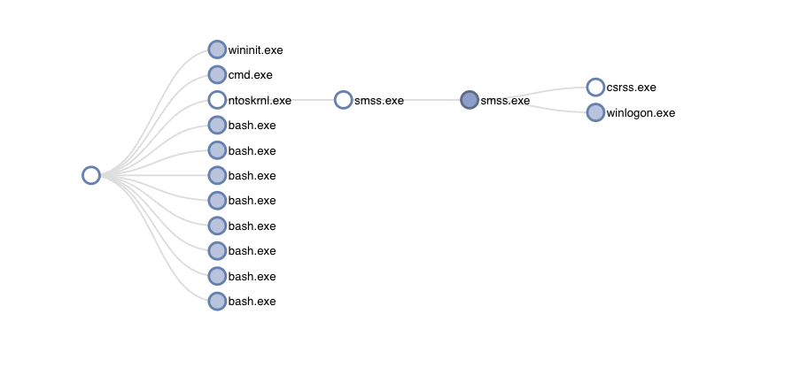

# process-tree-widget

An interactive process tree visualization widget for security and forensics analysis, built for [marimo](https://marimo.io) notebooks using the [anywidget](https://anywidget.dev) framework.

Please refer to [this blog post](https://www.linkedin.com/posts/anja-olsen-5a2643b9_visualizing-process-trees-with-marimo-and-activity-7301269407752683522-0kp5/?utm_source=share&utm_medium=member_desktop&rcm=ACoAADhsJbUBGCHud9Vayji0NXbs1mZ7yzVyygM) for background and context.



## Overview

The widget ingests OS process telemetry from two sources:

- **MDE (Microsoft Defender for Endpoint)** `ProcessCreated` events
- **Volatility** `pstree` memory forensics output

Both are normalized to a common [ASIM](https://learn.microsoft.com/en-us/azure/sentinel/normalization) schema, assembled into a tree structure, and rendered as an interactive D3-backed visualization with expand/collapse, zoom, right-click context menu, and an optional time-range filter.

### JavaScript rendering

The widget uses a vendored copy of [DependenTree](https://github.com/square/dependentree) (located in `js/dependentree/`) for the D3 tree layout, bundled directly by esbuild — no CDN fetch at runtime.

## Development setup

**Python:**

```bash
uv venv --python 3.12
uv sync
source .venv/bin/activate
```

**JavaScript:**

```bash
npm install
npm run dev   # watches js/ (including js/dependentree/) and rebuilds on change
```

**Demo notebook:**

```bash
marimo edit example.py
```

## Build commands

```bash
npm run build    # bundle js/ → src/process_tree_widget/static/ (esbuild, ESM, minified)
npm run dev      # same with inline sourcemaps + watch mode
uv build         # full Python package build (triggers npm run build via hatch-jupyter-builder)
```
